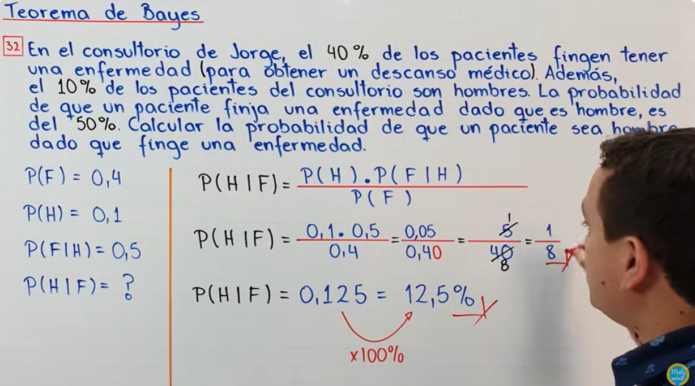
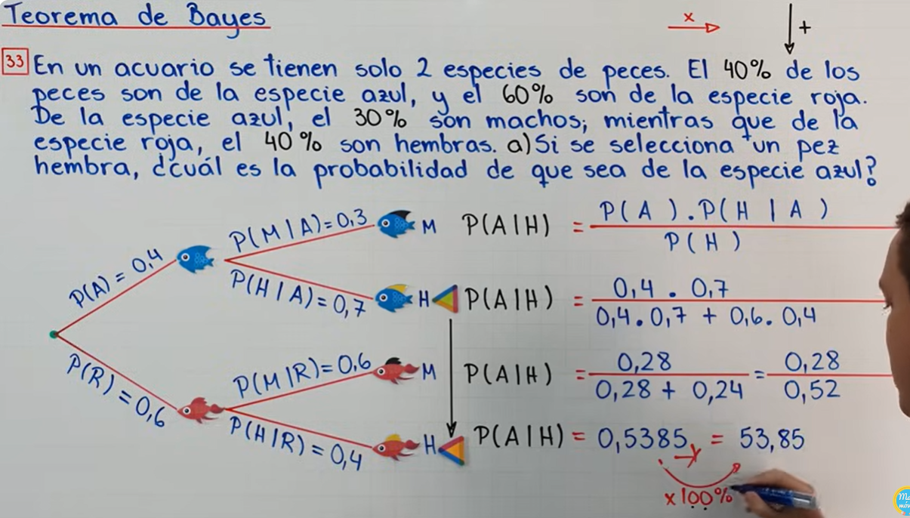
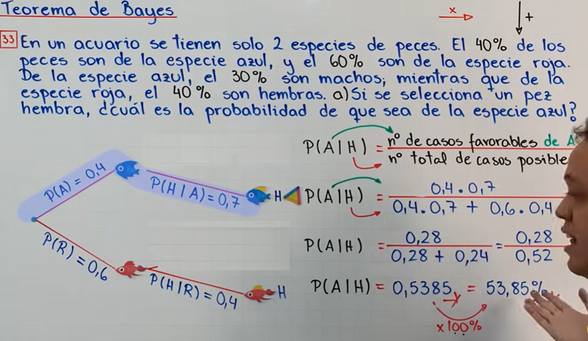
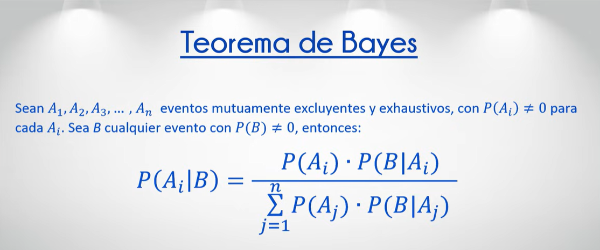

## Teorema de Bayes

Es utilizado para calcular la probabilidad de un suceso, teniendo información de antemano sobre ese suceso.

El **Teorema de Bayes** nos permite actualizar nuestras creencias sobre un evento con base en nueva información. En este caso, podemos usarlo para calcular la probabilidad de que una persona sea mayor de 50 años, dado que ya sabemos que tiene diabetes.

#### Fórmula del Teorema de Bayes

La fórmula general del teorema es:

$$
P(A|B) = \frac{P(B|A) \cdot P(A)}{P(B)}
$$

Donde:
- \( P(A|B) \) es la probabilidad de que una persona sea mayor de 50 años dado que tiene diabetes.
- \( P(B|A) \) es la probabilidad de que una persona tenga diabetes dado que es mayor de 50 años.
- \( P(A) \) es la probabilidad de que una persona sea mayor de 50 años.
- \( P(B) \) es la probabilidad de que una persona tenga diabetes.

#### Datos ficticios (del ejemplo anterior):
- **Probabilidad de tener diabetes dado que la persona es mayor de 50 años**: \( P(B|A) = 0.3333 \) (33.33%).
- **Probabilidad de que una persona tenga más de 50 años**: \( P(A) = 0.30 \) (30%).
- **Probabilidad de que una persona tenga diabetes**: \( P(B) = 0.14 \) (14%).

#### Cálculo usando el Teorema de Bayes:

Sustituyendo los valores en la fórmula:

$$
P(A|B) = \frac{0.3333 \times 0.30}{0.14} = \frac{0.09999}{0.14} \approx 0.714
$$

Resultado: 
La probabilidad de que una persona sea mayor de 50 años, dado que tiene diabetes, es aproximadamente **71.4%**.  

Otros ejemplos a continuacion: 

 
 

 
 

 

### Forma extendida
C.E.: Colectivamente exahustivos.   
M.E.: mutuamente excluyentes.  
Partición del espacio muestral.  

 