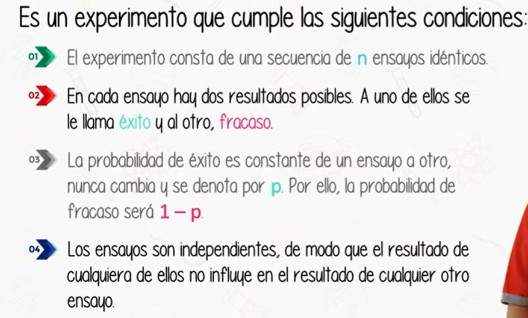
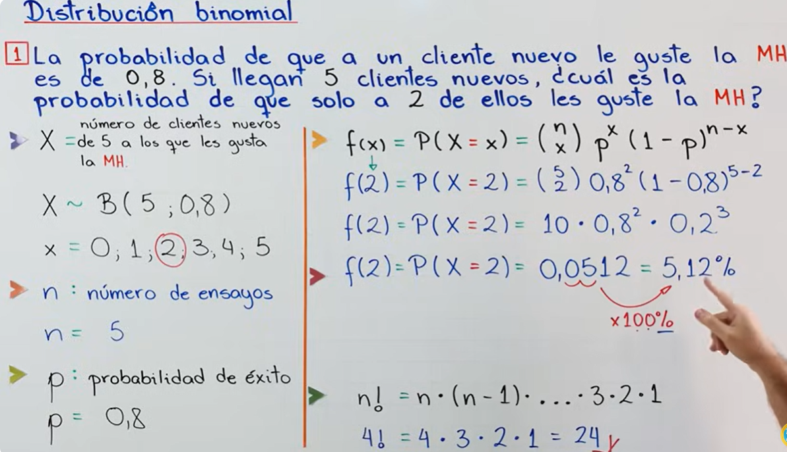
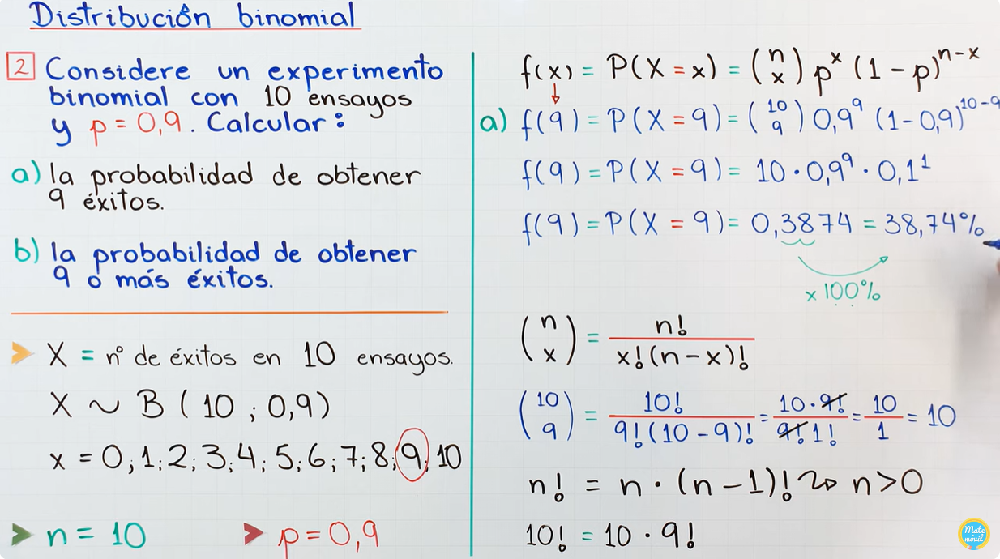
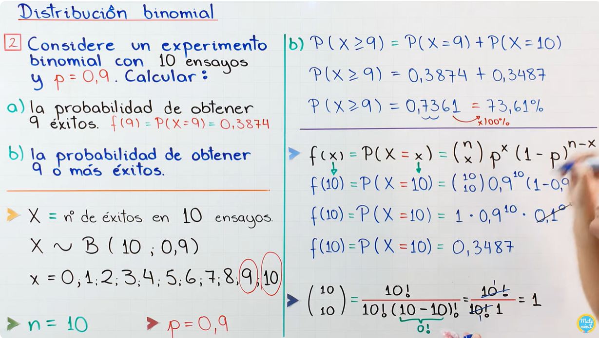
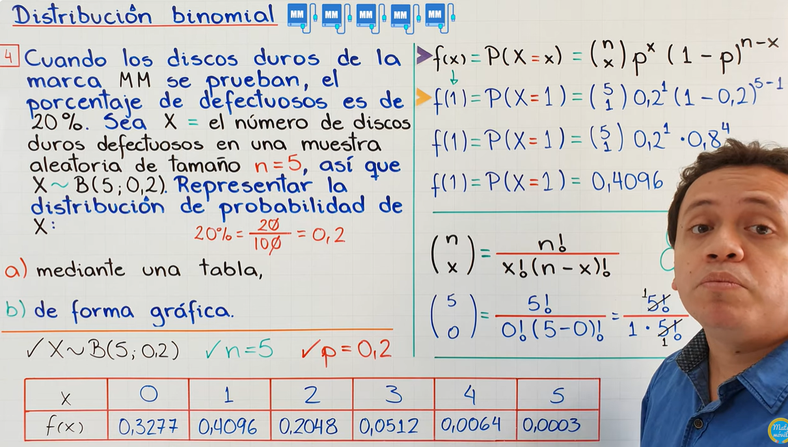
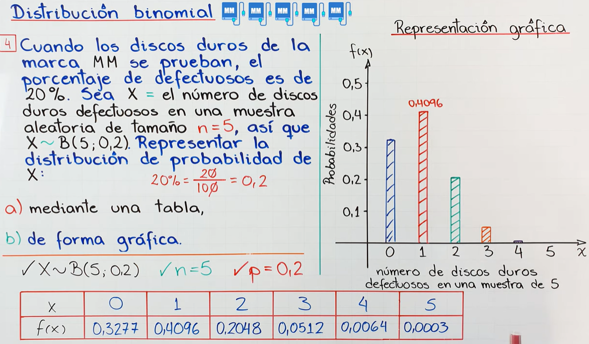

## Distribución binomial

Las Matematicas nos dicen que el orden de los factores no alteran el producto. 

¿Que es la distribución binomia? 

Es un modelo de probabilidad que describe el número de éxitos en una serie de ensayos independientes de tipo "éxito o fracaso", donde cada ensayo tiene la misma probabilidad de éxito. Es útil para situaciones donde hay solo dos posibles resultados, como "sí" o "no", "verdadero" o "falso", "aprobado" o "reprobado".

#### Características de la distribución binomial

Para que una situación se modele con una distribución binomial, debe cumplir con los siguientes criterios: 

1. Número fijo de ensayos 𝑛: La situación involucra un número específico de intentos o ensayos.
2. Resultados binarios: Cada ensayo tiene solo dos resultados posibles (éxito o fracaso).
3. Probabilidad constante de éxito 𝑝: La probabilidad de éxito es la misma para cada ensayo.
4. Independencia: Los resultados de cada ensayo no afectan a los demás.

### Fórmula de la Distribución Binomial

La fórmula para calcular la probabilidad de obtener exactamente \( k \) éxitos en \( n \) ensayos es:

$$
P(X = k) = \binom{n}{k} p^k (1 - p)^{n - k}
$$

Donde:
- \( P(X = k) \) es la probabilidad de obtener \( k \) éxitos.
- \( n \) es el número total de ensayos.
- \( k \) es el número de éxitos deseados.
- \( p \) es la probabilidad de éxito en cada ensayo.
- \( 1 - p \) es la probabilidad de fracaso.

El *coeficiente binomial* \( \binom{n}{k} \), también conocido como "combinaciones de \( n \) en \( k \)", se calcula como:

$$
\binom{n}{k} = \frac{n!}{k!(n - k)!}
$$
 

 

 
> Tenemos valores enteros y mayores o iguales que 0. La Distribución Binomial es una distribución de probabilidad D i s c r e t a, no continua.
 

> Estudiar Distribución de Poison y no confundir.

 

> No olvidar la variable aleatoria binomial que es la X mayúscula.

[Clase explicativa a YouTube](https://www.youtube.com/watch?v=HJgJGYDXojk&list=PL3KGq8pH1bFRKK6-4DHifbjLtnif-O7eW&index=2)

> N Factorial, representado como **n!**, es el producto de todos los números enteros positivos que hay entre el número n y el 1, ej. 4! = 4 * 3 * 2 * 1 = 24   
> NOTA: 0! es igual a 1

**Solución "a"**

 

**Solución "b"**

[Grafica y uso de calculadora, aquí.](https://youtu.be/Beaut1peTxY?si=T_erAPHPKlsvzvkZ&t=1012) :point_left:
 
#### Ejemplo con gráfica

**Representación Gráfica** 

