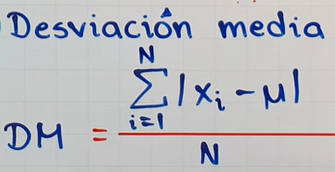
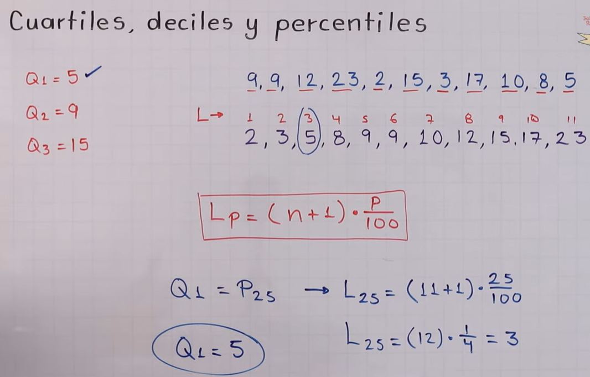

## Estadística descriptiva

Las estadísticas descriptivas abarcan una variedad de técnicas y medidas que se utilizan para resumir y describir los aspectos importantes de un conjunto de datos. Los temas principales de las estadísticas descriptivas incluyen:

- [Estadística descriptiva](#estadística-descriptiva)
  - [1. Medidas de Tendencia Central](#1-medidas-de-tendencia-central)
    - [Algunos ejemplos:](#algunos-ejemplos)
  - [2. Medidas de Dispersión (o Variabilidad)](#2-medidas-de-dispersión-o-variabilidad)
    - [Rango](#rango)
    - [Varianza y Desviación Estándar](#varianza-y-desviación-estándar)
    - [Coeficiente de Variacion](#coeficiente-de-variacion)
    - [Desviación Media](#desviación-media)
  - [3. Medidas de Posición](#3-medidas-de-posición)
  - [4. Distribución de Frecuencia](#4-distribución-de-frecuencia)
  - [5. Representación Gráfica de Datos](#5-representación-gráfica-de-datos)
  - [6. Medidas de Forma y Simetría](#6-medidas-de-forma-y-simetría)

### 1. Medidas de Tendencia Central
   Estas medidas describen el punto central o típico de un conjunto de datos que tienen como objetivo encontrar la parte central de un conjunto de datos.
   - **Media**: El promedio de todos los valores.
   - **Mediana**: El valor central en un conjunto de datos ordenado. 
   - **Moda**: El valor que más se repite en el conjunto de datos.

| Medida    | Fórmula | Descripción|
|-----------|---------|------------|
| **Media** |  | Es el valor que se obtiene al sumar todos los datos y dividir el resultado entre la cantidad de datos.|
| **Mediana**|| Es el valor que ocupa la posición central cuando todos los datos están ordenados.|
| **Moda** | | Es el valor que más se repite. Es el valor con mayor frecuencia absoluta. |

#### Algunos ejemplos:
| Medida    | Ejercicio |
|-----------|---------|
| **Media**  | |
| **Mediana** | |
| **Moda**    |         |

> * Cuando en la **Mediana** la cantidad de valores es un número par, tenemos que tomar la **Media** aritmética, la suma de ambos dividido entre 2.  
> * Cuando no hay un valor que **más** se repite, entonces no hay **Moda**.

---

### 2. Medidas de Dispersión (o Variabilidad)
   Las medidas de dispersión indican que tan dispersos o separados se encuentran los datos alrededor de la tendencia central. Son medidas estadísticas que muestran la variabilidad en la distribución de los datos.

   #### Rango

| Media                          | Fórmula            |Descripción   |
|------------------------------- |--------------------|------------- |
| **Rango, Amplitud o Recorrido**|  Rango = valor máximo - valor mínimo| Es la diferencia entre el valor máximo y el mínimo de un conjunto de datos.|

Ejercicio Practico:  

> **Población:** Es el conjunto de todos los elementos cuya caracteristicas se van a estudiar.  
> **Muestra:** Es un subconjunto de la población. 

#### Varianza y Desviación Estándar

> ¿Que es la varianza y la desviación estándar? La varianza y la desviación estándar son medidas de dispersión que indican qué tan alejados están los valores de los datos respecto a la media (promedio) de un conjunto de datos.

* La varianza mide la media de las desviaciones al cuadrado respecto a la media. Cuanto mayor sea la varianza, más dispersos estarán los datos.
* La desviación estándar es la raíz cuadrada de la varianza y proporciona una medida de dispersión en las mismas unidades que los datos originales.  

 
|| **Varianza**  | **Desviación Estándar**| **Media** |
|---- |---------------|------------------------|-----------|
| **Población**|Letra y griega sigma elevada al cuadrado y es igual a la sumatoria desde i=1 hasta n (del valor de cada uno de los elementos de la población menos la media poblacional) elevado al cuadrado divido entre el numero de elementos de la población.|Letra y griega sigma, la desviación estándar es la raíz cuadrada positiva de la varianza.|Letra M es igual a la sumatoria desde i=1 hasta n del valor de cada uno de los elementos de la población entre el número de elementos.|
| **Muestra** | Letra "s" elevado al cuadrado y es igual a la sumatoria desde i=1 hasta n del valor de cada una de las observaciones de la muestra menos la media muestral elevada al cuadrado y dividido entre el número de observaciones de la muestra menos 1.| Letra "s" es la desviación estándar de la muestra. La desviación estándar es la raíz cuadrada positiva de la varianza.| La X raya ariba es la media de la muestra, suma los valores y la divide entre la cantidad de valores.| 

 

**Explicación de los símbolos:** 

|      **Representación**               |  **Sonido**               |
|---------------------------------- |---------------------------|
| |  |

**Ejercicios Practicos**

Varianza poblacional: 

> Y para sacar la desviación estándar poblacional del ejercicio anterior, solo sacamos la raíz cuadrada. 
> 

Varianza muestral:  

> Y para sacar la desviación estándar muestral del ejercicio anterior, solo sacamos la raíz cuadrada. 

**Ejemplos en tablas de frecuencia por intervalos:**
| Varianza y Desviación Poblacional    | Varianza y Desviación Muestral|
|--------------------------------------|-------------------------------|
|  | |

#### Coeficiente de Variacion

* Es una medida de dispersión relativa (no tiene unidades de medida: ~~kg~~, ~~cm~~).
* Se define como el  cociente entre la desviación estándar y la media.
* Se usa para comparar la variabilidad o dispersión en conjuntos de datos con diferentes unidades de medida.
* También es útil para comparar la variabilidad o dispersión en conjuntos de datos con diferentes medidas.
  

|        **Forma Relativa**            |       **Forma Porcentual**    |
|--------------------------------------|-------------------------------|
|  | |

**Ejemplos de Coeficiente de variación**

|        **Ejemplo 1**            |       **Ejemplo 2**    |
|--------------------------------------|-------------------------------|
|  | |

#### Desviación Media

Es la media aritmética de los valores absolutos de lo que se desvía cada valor respecto a la media. La desviación media siempre va a quedar expresada en las misma unidades que los valores originales.

> Hay que hacer enfasis en la palabra **absoluto**, ya que los numeros negativos pasarán a positivos solo por el simple hecho de pasar a desviación media.

 Esta formula esta expresada en muestra y no en población, para cambiarla a población la n tiene que pasar a mayúscula "N" y la media de los datos pasa a ser la letra "M" mu. 

**Esta es la formula de la desviación media para la población**

**Y como se ha explicado antes, no existen numeros negativos, así que la siguiente gráfica se explicará en números positivos**

|        **Ejemplo 1**             |       **Ejemplo 2**    |
|----------------------------------|-------------------------------|
|  | |

> Los ejercicios entre corchetes significa que los datos se encuentran ante un extremo cerrado.

**Ejemplo completo de medidas de dispersión para datos no agrupados.**

[Medidas de dispersión para datos agrupados, aquí.](https://youtu.be/VjCeoPLmbhI?si=ME5QYHxLzO3FVyN-) :point_left:

---

### 3. Medidas de Posición
   Estas medidas muestran cómo se sitúan ciertos valores dentro del conjunto de datos y permiten conocer la **ubicación** relativa de un valor en comparación con otros valores del conjunto. Incluyen:

   - **Cuartiles**: representan los valores 25%, 50% y 75%. **Q2 coincide con la mediana.**
   - **Percentiles**: Son 100 valores que se representan en 99 posiciones donde el Q1 va a estar en la misma posición que el percentil 25, el Q2 en el percentil 50 y el Q3 en el percentil 75. El decil 8 es igual al percentil 80.
   - **Deciles**: determinan los valores 10%, 20%, 30%,...90% de los datos, D5 coincide con Me.
   - **Rango Intercuartílico**: La diferencia entre el percentil 75 y el percentil 25.

                                                                                                              
| Media           | Fórmula Impar   | Formula Par       |Descripción   |
|-----------------|-----------------|-------------------|------------- |
| **Cuartiles**   | |  |Son 3 valores de la variable que dividen a un conjunto de datos ordenados en **4** partes iguales.|
| **Percentiles** | |  |Los percentiles son 99 valores que dividen un conjunto de datos ordenados en **100** partes iguales. |
| **Deciles**     |                    |   |Son 9 valores de la variable que **dividen** el conjunto de datos ordenados en **10** partes iguales. K es la posición que quiero encontra.           |
                         

**Explicación de distribución**

**Ejemplos:**

|    **Q1**   |      **Q2**       | **Q3** |
|-------------|-------------------|--------|
| ||

---

### 4. Distribución de Frecuencia
   Una forma de representar datos agrupados en intervalos, mostrando cuántas veces ocurre cada valor o rango de valores:
   - **Tablas de frecuencia**: A grupan los datos en categorías o intervalos.
   - **Frecuencia relativa**: La proporción de veces que un valor ocurre en relación al total de valores.
   - **Frecuencia acumulada**: La suma de las frecuencias hasta un cierto punto en el conjunto de datos.
                                                                         

| Media                   | Fórmula            |Descripción   |
|-------------------------|--------------------|------------- |
| **Tablas de frecuencia**|                    |              |
| **Frecuencia relativa** |                    |              |
| **Frecuencia acumulada**|                    |              |

### 5. Representación Gráfica de Datos
   Las gráficas son herramientas visuales para analizar la distribución y las características de los datos. Ejemplos de gráficos usados en estadísticas descriptivas:                                                        

| Medida                        |Representación  |Descripción|
|-------------------------------|-------------|--------------|
| **Histogramas**       | |Representan la frecuencia de los datos en intervalos.|
| **Gráficos de barras**        | |Comparan diferentes categorías o valores.|
| **Diagramas de caja**         | |Muestran la dispersión y detectan posibles valores atípicos.|
| **Gráficos circulares**       | |Representan porcentajes de un total.|
| **Gráficos de dispersión**    | |Usados para ver relaciones entre dos variables.|

### 6. Medidas de Forma y Simetría
   Estas medidas describen la forma de la distribución de los datos:

| Medida                   | Representación | Descripción |
|--------------------------|--------------|---------------|
| **Asimetría (skewness)** ||Indica si la distribución tiene sesgo hacia la derecha o hacia la izquierda.|           
| **Curtosis**             ||  Mide el grado de concentración de los datos en el centro de la distribución; puede indicar si la distribución es más o menos "puntiaguda" en comparación con una distribución normal.|

