# Estadísticas


## Índice

- [Estadísticas](#estadísticas)
  - [Índice](#índice)
  - [Probabilidades condicionales](#probabilidades-condicionales)
    - [Ejemplo: Probabilidad de tener diabetes dado que la persona es mayor de 50 años](#ejemplo-probabilidad-de-tener-diabetes-dado-que-la-persona-es-mayor-de-50-años)
      - [Información ficticia:](#información-ficticia)
      - [Queremos calcular:](#queremos-calcular)
      - [Fórmula de la probabilidad condicional:](#fórmula-de-la-probabilidad-condicional)
      - [Sustituimos los valores:](#sustituimos-los-valores)
  - [Teorema de Bayes](#teorema-de-bayes)
      - [Fórmula del Teorema de Bayes](#fórmula-del-teorema-de-bayes)
      - [Datos ficticios (del ejemplo anterior):](#datos-ficticios-del-ejemplo-anterior)
      - [Cálculo usando el Teorema de Bayes:](#cálculo-usando-el-teorema-de-bayes)
    - [Forma extendida](#forma-extendida)
  - [Distribución binomial](#distribución-binomial)
      - [Características de la distribución binomial](#características-de-la-distribución-binomial)
    - [Fórmula de la Distribución Binomial](#fórmula-de-la-distribución-binomial)
      - [Ejemplo con gráfica](#ejemplo-con-gráfica)
  - [Estadística descriptiva](#estadística-descriptiva)
    - [1. Medidas de Tendencia Central](#1-medidas-de-tendencia-central)
    - [2. Medidas de Dispersión](#2-medidas-de-dispersión)
    - [3. Medidas de Posición](#3-medidas-de-posición)
    - [4. Distribución de Frecuencia](#4-distribución-de-frecuencia)
    - [5. Representación Gráfica de Datos](#5-representación-gráfica-de-datos)
    - [6. Medidas de Forma y Simetría](#6-medidas-de-forma-y-simetría)
  - [Ley de grandes números](#ley-de-grandes-números)
  - [Teorema central del límite](#teorema-central-del-límite)
  - [Regresiones lineales](#regresiones-lineales)
      
      
  
  
## Probabilidades condicionales

<p>Es la posibilidad de que ocurra un evento, al que denominamos A, como consecuencia, de que ha tenido lugar otro evento, al que denominamos B.</p>

> ### Puntos clave
> * Mide la probabilidad de que ocurra algo (A) despues de que ya ha ocurrido otra cosa distinta (B).<br>
> <br>
> * A diferencia de la probabilidad independiente, en la condicional, la ocurrencia de un evento sí afecta la probabilidad del otro.<br>
> <br>
> * Su fórmula es: P(A|B) = P(A ∩ B) / P(B). Dividir entre cero siempre nos va a traer problemas.<br>
> <br>

<p>Lo que queremos calcular es la probabilidad de que ocurra el evento A dado que ha ocurrido B. Es seguro que ha ocurrido B, sí o sí.</p>


Entonces estaremos concentrados solo en la intersección.<br>


> Formula de la probabilidad:
$$
P(A) = \frac{\text{Número de casos favorables}}{\text{Número total de casos posibles}}
$$
### Ejemplo: Probabilidad de tener diabetes dado que la persona es mayor de 50 años

Supongamos que estamos analizando datos sobre la población mexicana y queremos calcular la probabilidad condicional de que una persona tenga diabetes, dado que ya sabemos que la persona tiene más de 50 años.

#### Información ficticia:
- **Probabilidad de que una persona en México tenga diabetes**: \( P(D) = 0.14 \) (14% de la población tiene diabetes).
- **Probabilidad de que una persona tenga más de 50 años**: \( P(A) = 0.30 \) (30% de la población tiene más de 50 años).
- **Probabilidad de que una persona tenga diabetes y sea mayor de 50 años**: \( P(D ∩ A) = 0.10 \) (10% de la población tiene diabetes y es mayor de 50 años).

#### Queremos calcular:
La **probabilidad condicional** de que una persona tenga diabetes dado que ya sabemos que tiene más de 50 años, es decir, \( P(D | A) \).

#### Fórmula de la probabilidad condicional:

$$
P(D | A) = \frac{P(D \cap A)}{P(A)}
$$

Donde:
- \( P(D | A) \) es la probabilidad de tener diabetes dado que la persona tiene más de 50 años.
- \( P(D ∩ A) \) es la probabilidad de que la persona tenga diabetes y sea mayor de 50 años.
- \( P(A) \) es la probabilidad de que la persona tenga más de 50 años.

#### Sustituimos los valores:

$$
P(D | A) = \frac{0.10}{0.30} = 0.3333
$$

Resultado:<br>
La probabilidad condicional de que una persona tenga diabetes, dado que tiene más de 50 años, es aproximadamente **33.33%**.

Esto significa que si ya sabes que una persona es mayor de 50 años, la probabilidad de que esa persona tenga diabetes es del 33.33%, lo cual es mayor que la probabilidad general en la población (14%).

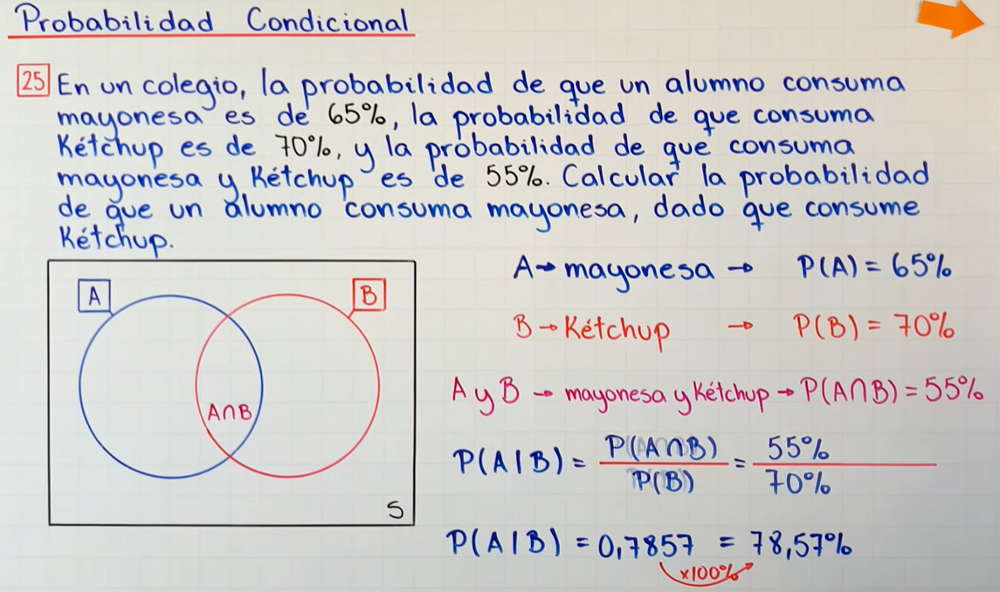
<br>
<br>
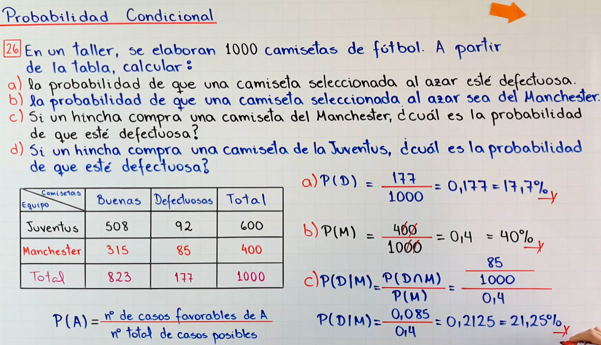

---

## Teorema de Bayes

<p>Es utilizado para calcular la probabilidad de un suceso, teniendo información de antemano sobre ese suceso.</p>

El **Teorema de Bayes** nos permite actualizar nuestras creencias sobre un evento con base en nueva información. En este caso, podemos usarlo para calcular la probabilidad de que una persona sea mayor de 50 años, dado que ya sabemos que tiene diabetes.

#### Fórmula del Teorema de Bayes

La fórmula general del teorema es:

$$
P(A|B) = \frac{P(B|A) \cdot P(A)}{P(B)}
$$

Donde:
- \( P(A|B) \) es la probabilidad de que una persona sea mayor de 50 años dado que tiene diabetes.
- \( P(B|A) \) es la probabilidad de que una persona tenga diabetes dado que es mayor de 50 años.
- \( P(A) \) es la probabilidad de que una persona sea mayor de 50 años.
- \( P(B) \) es la probabilidad de que una persona tenga diabetes.

#### Datos ficticios (del ejemplo anterior):
- **Probabilidad de tener diabetes dado que la persona es mayor de 50 años**: \( P(B|A) = 0.3333 \) (33.33%).
- **Probabilidad de que una persona tenga más de 50 años**: \( P(A) = 0.30 \) (30%).
- **Probabilidad de que una persona tenga diabetes**: \( P(B) = 0.14 \) (14%).

#### Cálculo usando el Teorema de Bayes:

Sustituyendo los valores en la fórmula:

$$
P(A|B) = \frac{0.3333 \times 0.30}{0.14} = \frac{0.09999}{0.14} \approx 0.714
$$

Resultado:<br>
La probabilidad de que una persona sea mayor de 50 años, dado que tiene diabetes, es aproximadamente **71.4%**. <br>

Otros ejemplos a continuacion:<br>

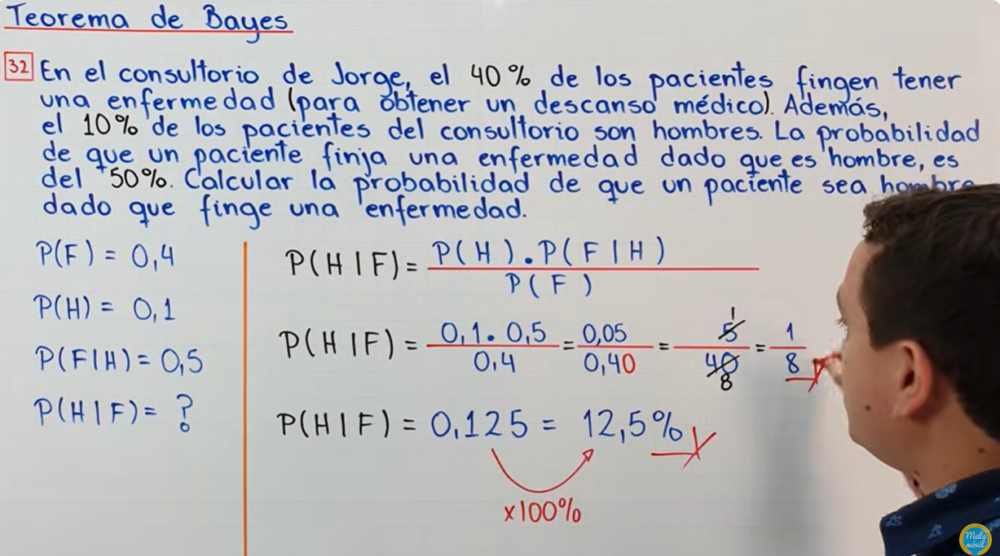
<br>
<br>
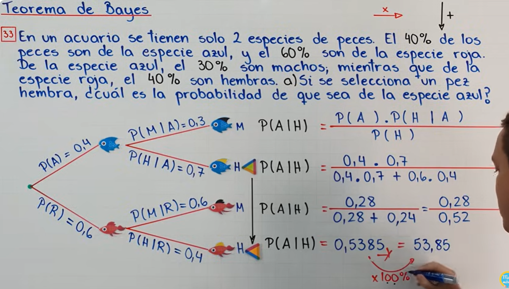
<br>
<br>
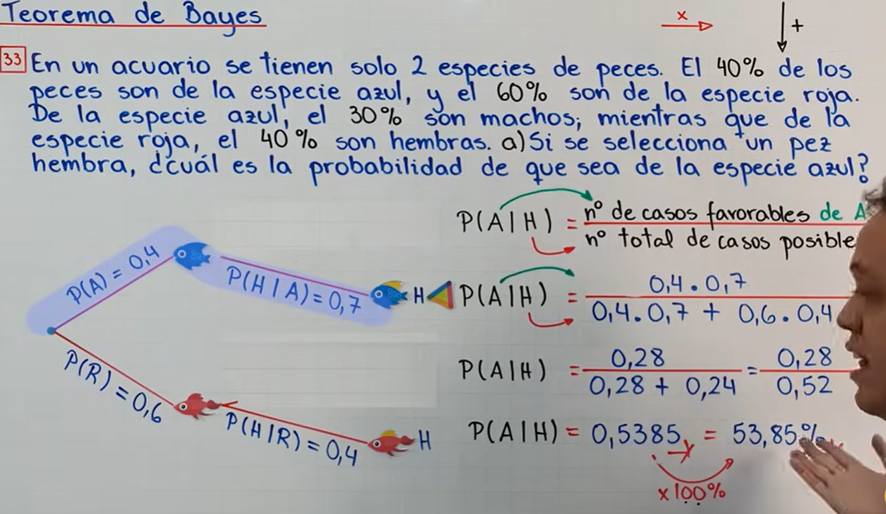
<br>

### Forma extendida
C.E.: Colectivamente exahustivos. <br> 
M.E.: mutuamente excluyentes. <br>
Partición del espacio muestral. <br>

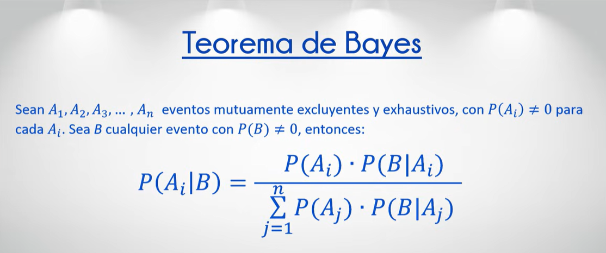
<br>

## Distribución binomial

Las Matematicas nos dicen que el orden de los factores no alteran el producto.<br>

¿Que es la distribución binomia?<br>
<p>
Es un modelo de probabilidad que describe el número de éxitos en una serie de ensayos independientes de tipo "éxito o fracaso", donde cada ensayo tiene la misma probabilidad de éxito. Es útil para situaciones donde hay solo dos posibles resultados, como "sí" o "no", "verdadero" o "falso", "aprobado" o "reprobado".
</p>

#### Características de la distribución binomial

Para que una situación se modele con una distribución binomial, debe cumplir con los siguientes criterios:<br>

1. Número fijo de ensayos 𝑛: La situación involucra un número específico de intentos o ensayos.
2. Resultados binarios: Cada ensayo tiene solo dos resultados posibles (éxito o fracaso).
3. Probabilidad constante de éxito 𝑝: La probabilidad de éxito es la misma para cada ensayo.
4. Independencia: Los resultados de cada ensayo no afectan a los demás.

### Fórmula de la Distribución Binomial

La fórmula para calcular la probabilidad de obtener exactamente \( k \) éxitos en \( n \) ensayos es:

$$
P(X = k) = \binom{n}{k} p^k (1 - p)^{n - k}
$$

Donde:
- \( P(X = k) \) es la probabilidad de obtener \( k \) éxitos.
- \( n \) es el número total de ensayos.
- \( k \) es el número de éxitos deseados.
- \( p \) es la probabilidad de éxito en cada ensayo.
- \( 1 - p \) es la probabilidad de fracaso.

El *coeficiente binomial* \( \binom{n}{k} \), también conocido como "combinaciones de \( n \) en \( k \)", se calcula como:

$$
\binom{n}{k} = \frac{n!}{k!(n - k)!}
$$
<br>


<br>
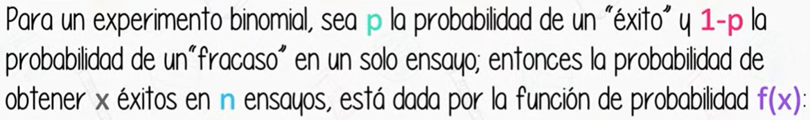
<br>
> Tenemos valores enteros y mayores o iguales que 0. La Distribución Binomial es una distribución de probabilidad D i s c r e t a, no continua.
<br>

> Estudiar Distribución de Poison y no confundir.

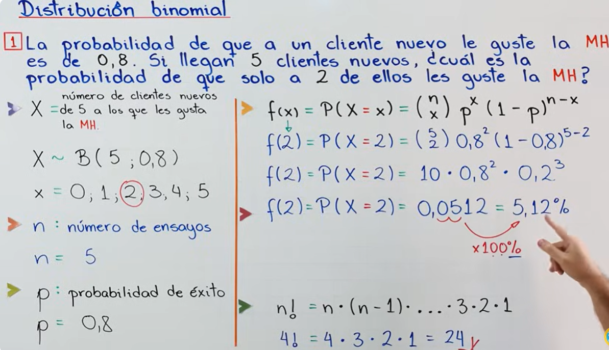

<br>

> No olvidar la variable aleatoria binomial que es la X mayúscula.

[Clase explicativa a YouTube](https://www.youtube.com/watch?v=HJgJGYDXojk&list=PL3KGq8pH1bFRKK6-4DHifbjLtnif-O7eW&index=2)

> N Factorial, representado como **n!**, es el producto de todos los números enteros positivos que hay entre el número n y el 1, ej. 4! = 4 * 3 * 2 * 1 = 24   
> NOTA: 0! es igual a 1

**Solución "a"**

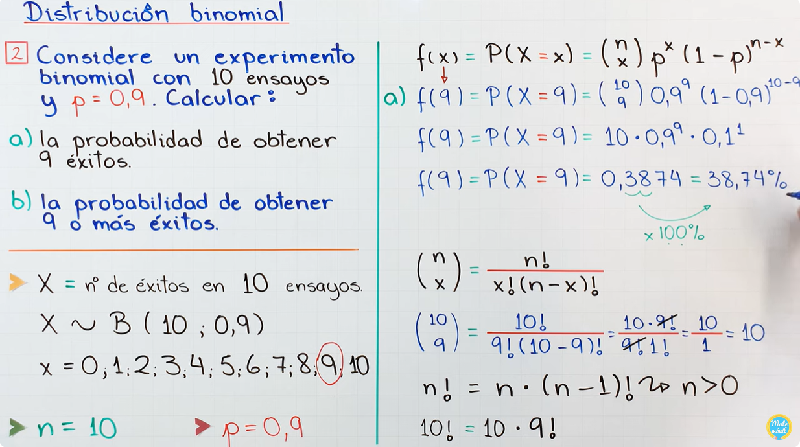
<br>

**Solución "b"**


[Grafica y uso de calculadora, aquí.](https://youtu.be/Beaut1peTxY?si=T_erAPHPKlsvzvkZ&t=1012)
<br>
#### Ejemplo con gráfica
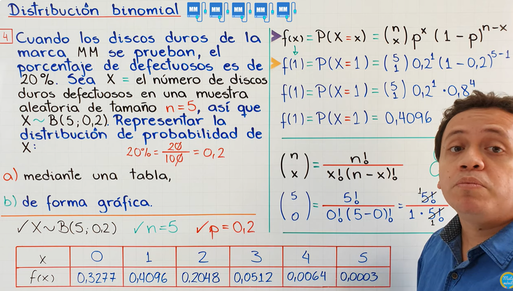

**Representación Gráfica** 

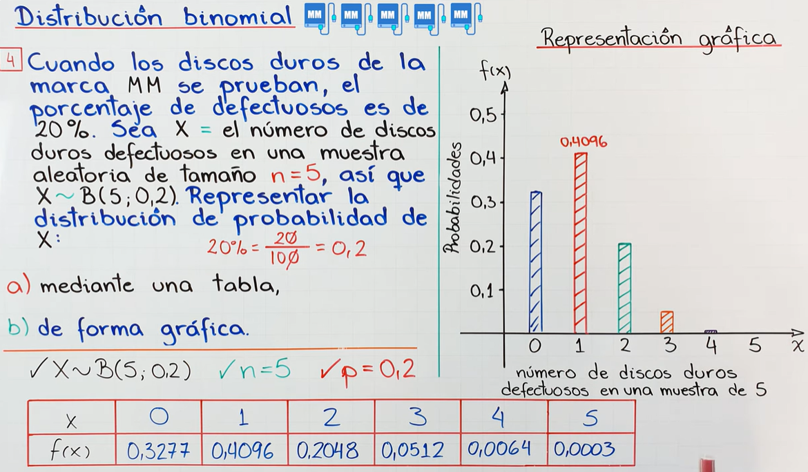

## Estadística descriptiva

<p>Las estadísticas descriptivas abarcan una variedad de técnicas y medidas que se utilizan para resumir y describir los aspectos importantes de un conjunto de datos. Los temas principales de las estadísticas descriptivas incluyen:</p>

### 1. Medidas de Tendencia Central
   Estas medidas describen el punto central o típico de un conjunto de datos. Incluyen:
   - **Media**: El promedio de todos los valores.
   - **Mediana**: El valor central en un conjunto de datos ordenado.
   - **Moda**: El valor que más se repite en el conjunto de datos.

| Categoría                   | Medida                        | Fórmula / Descripción                                                                                                                                                        |
|-----------------------------|-------------------------------|------------------------------------------------------------------------------------------------------------------------------------------------------------------------------|
| **Medidas de Tendencia Central** | **Media**                  | \( \bar{x} = \frac{\sum_{i=1}^n x_i}{n} \) donde \( x_i \) son los valores y \( n \) es el número total de observaciones.                                                   |
|                             | **Mediana**                   | Valor central en un conjunto ordenado: si \( n \) es impar, es el valor en \( \frac{n+1}{2} \); si \( n \) es par, es el promedio de los dos valores centrales.               |
|                             | **Moda**                      | Valor que aparece con mayor frecuencia en el conjunto de datos.                                                                                                              |


### 2. Medidas de Dispersión
   Las medidas de dispersión indican cuánto varían o se dispersan los datos alrededor de la tendencia central. Incluyen:
   - **Rango**: La diferencia entre el valor máximo y el mínimo.
   - **Varianza**: La medida de cuánto varían los valores respecto a la media.
   - **Desviación estándar**: La raíz cuadrada de la varianza, utilizada para medir la dispersión en las mismas unidades que los datos.
   - **Coeficiente de variación**: Expresa la desviación estándar como un porcentaje de la media.

| Categoría                   | Medida                        | Fórmula / Descripción                                                                                                                                                        |
|-----------------------------|-------------------------------|------------------------------------------------------------------------------------------------------------------------------------------------------------------------------|
| **Medidas de Dispersión**   | **Rango**                     | \( R = \text{Valor máximo} - \text{Valor mínimo} \)                                                                                                                          |
|                             | **Varianza**                  | \( \sigma^2 = \frac{\sum_{i=1}^n (x_i - \bar{x})^2}{n} \) para una población, o \( s^2 = \frac{\sum_{i=1}^n (x_i - \bar{x})^2}{n-1} \) para una muestra.                    |
|                             | **Desviación estándar**       | \( \sigma = \sqrt{\frac{\sum_{i=1}^n (x_i - \bar{x})^2}{n}} \) para una población, o \( s = \sqrt{\frac{\sum_{i=1}^n (x_i - \bar{x})^2}{n-1}} \) para una muestra.           |
|                             | **Coeficiente de variación**  | \( CV = \frac{\sigma}{\bar{x}} \times 100 \)                                                                                                                                 |
### 3. Medidas de Posición
   Estas medidas muestran cómo se sitúan ciertos valores dentro del conjunto de datos y permiten conocer la ubicación relativa de un valor en comparación con otros valores del conjunto. Incluyen:
   - **Cuartiles**: Dividen el conjunto de datos en cuatro partes iguales.
   - **Percentiles**: Dividen los datos en 100 partes iguales.
   - **Deciles**: Dividen los datos en 10 partes iguales.

| Categoría                   | Medida                        | Fórmula / Descripción                                                                                                                                                        |
|-----------------------------|-------------------------------|------------------------------------------------------------------------------------------------------------------------------------------------------------------------------|
| **Medidas de Posición**     | **Cuartiles**                | Valores que dividen el conjunto de datos en cuatro partes iguales.                                                                                                           |
|                             | **Percentiles**              | Valores que dividen el conjunto de datos en 100 partes iguales.                                                                                                              |
|                             | **Deciles**                  | Valores que dividen el conjunto de datos en 10 partes iguales.                                                                                                               

### 4. Distribución de Frecuencia
   Una forma de representar datos agrupados en intervalos, mostrando cuántas veces ocurre cada valor o rango de valores:
   - **Tablas de frecuencia**: Agrupan los datos en categorías o intervalos.
   - **Frecuencia relativa**: La proporción de veces que un valor ocurre en relación al total de valores.
   - **Frecuencia acumulada**: La suma de las frecuencias hasta un cierto punto en el conjunto de datos.

| Categoría                   | Medida                        | Fórmula / Descripción                                                                                                                                                        |
|-----------------------------|-------------------------------|------------------------------------------------------------------------------------------------------------------------------------------------------------------------------|
| **Distribución de Frecuencia** | **Tablas de frecuencia** | Tabulación que agrupa los datos en intervalos y muestra cuántas veces ocurre cada valor o rango.                                                                             |
|                             | **Frecuencia relativa**       | Proporción de veces que ocurre un valor: \( \text{Frecuencia relativa} = \frac{\text{Frecuencia del valor}}{\text{Número total de observaciones}} \)                         |
|                             | **Frecuencia acumulada**      | Suma de las frecuencias de todos los valores hasta un punto específico en el conjunto de datos.                                                                              

### 5. Representación Gráfica de Datos
   Las gráficas son herramientas visuales para analizar la distribución y las características de los datos. Ejemplos de gráficos usados en estadísticas descriptivas:
   - **Histogramas**: Representan la frecuencia de los datos en intervalos.
   - **Gráficos de barras**: Comparan diferentes categorías o valores.
   - **Diagramas de caja (box plots)**: Muestran la dispersión y detectan posibles valores atípicos.
   - **Gráficos circulares**: Representan porcentajes de un total.
   - **Gráficos de dispersión**: Usados para ver relaciones entre dos variables.

|   | Medida                        |Descripción  |
|-----------------------------|-------------------------------|----------------------------------------------------------------------------------------------------|
|  | **Histogramas**       |                                    |
|                             | **Gráficos de barras**        | 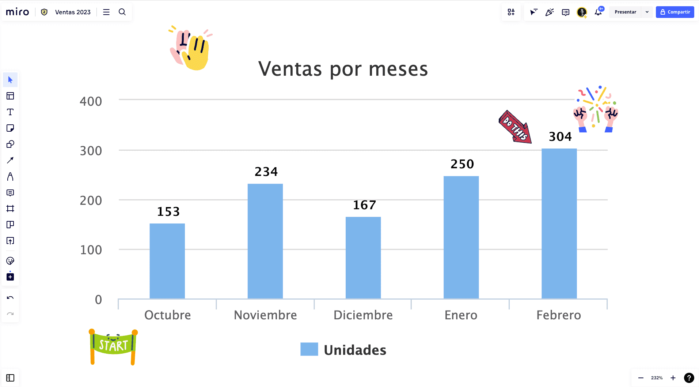                                                              |
|                             | **Diagramas de caja**         | 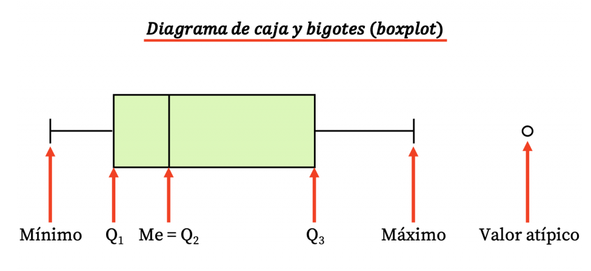    |
|                             | **Gráficos circulares**       | 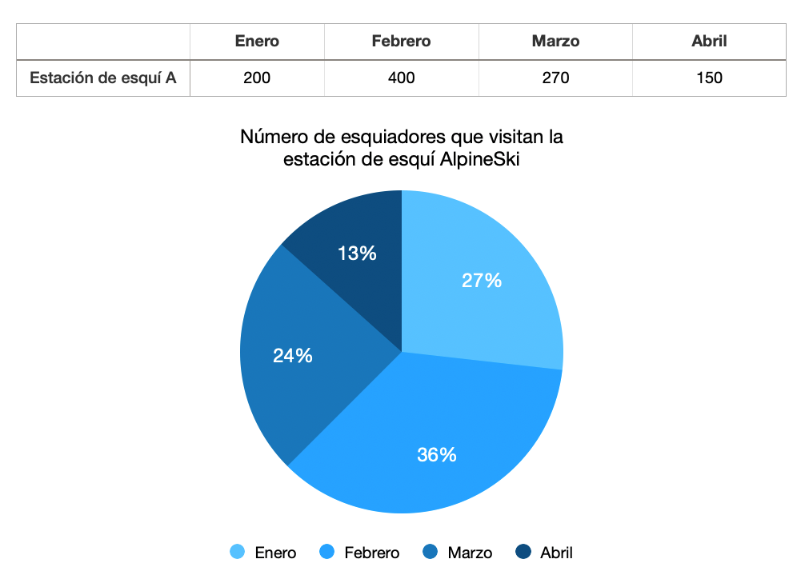                                                                                                                          |
|                             | **Gráficos de dispersión**    | 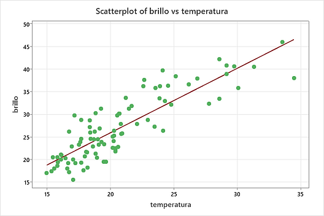                                                                                                                       

### 6. Medidas de Forma y Simetría
   Estas medidas describen la forma de la distribución de los datos:
   - **Asimetría (skewness)**: Indica si la distribución tiene sesgo hacia la derecha o hacia la izquierda.
   - **Curtosis**: Mide el grado de concentración de los datos en el centro de la distribución; puede indicar si la distribución es más o menos "puntiaguda" en comparación con una distribución normal.

|        | Medida                        | Descripción                                                                                                                                                        |
|-----------------------------|-------------------------------|---------------------------------------------------------------------|
|| **Asimetría (skewness)** |   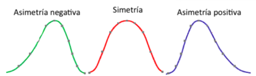                                                                 |
|                             | **Curtosis**                 | 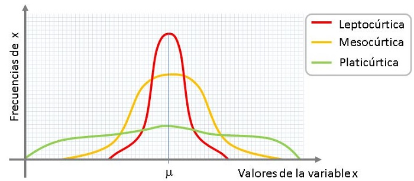 |


---

## Ley de grandes números
Aquí va el contenido de la sección de la ley de grandes números.
> esta es una nota

## Teorema central del límite
Aquí va el contenido de la sección del teorema central del límite.
> esta es una nota

## Regresiones lineales
Aquí va el contenido de la sección de regresiones lineales.
> esta es una nota


`
Codigo
    escrrito
    para programadores
    que
necesita codigo
`

```python
print("hello world")
```

| Table | Are   | Cool  |
|-------|-------|-------|
| Mesa  | es    | chida |
| quiero| comer | carne |
|       |       |       |

  


