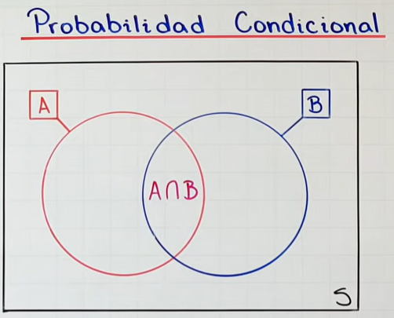
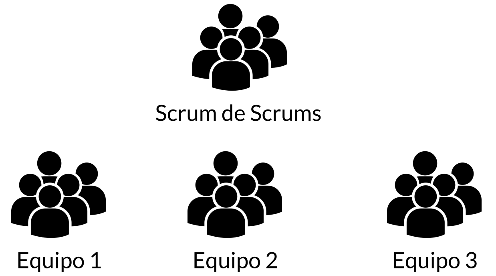

# Estadísticas


## Índice
- [Estadísticas](#estadísticas)
  - [Índice](#índice)
  - [Probabilidades condicionales](#probabilidades-condicionales)
  - [Teorema de Bayes](#teorema-de-bayes)
  - [Distribución binomial](#distribución-binomial)
  - [Estadística descriptiva](#estadística-descriptiva)
  - [Ley de grandes números](#ley-de-grandes-números)
  - [Teorema central del límite](#teorema-central-del-límite)
  - [Regresiones lineales](#regresiones-lineales)
      - [Alt + 91 para crear corchetes](#alt--91-para-crear-corchetes)


1. uno
2. dos
3. tres


## Probabilidades condicionales

<p>Es la posibilidad de que ocurra un evento, al que denominamos A, como consecuencia, de que ha tenido lugar otro evento, al que denominamos B.</p>

> ### Puntos clave
> * Mide la probabilidad de que ocurra algo (A) despues de que ya ha ocurrido otra cosa distinta (B).<br>
> <br>
> * A diferencia de la probabilidad independiente, en la condicional, la ocurrencia de un evento sí afecta la probabilidad del otro.<br>
> <br>
> * Su fórmula es: P(A|B) = P(A ∩ B) / P(B). Dividir entre cero siempre nos va a traer problemas.<br>
> <br>

<p>Lo que queremos calcular es la probabilidad de que ocurra el evento A dado que ha ocurrido B. Es seguro que ha ocurrido B, sí o sí.</p>



Entonces estaremos concentrados solo de la intersección.


## Teorema de Bayes
Aquí va el contenido de la sección del teorema de Bayes.
> esta es una nota

## Distribución binomial
Aquí va el contenido de la sección de la distribución binomial.
> esta es una nota

## Estadística descriptiva
Aquí va el contenido de la sección de estadística descriptiva.
> esta es una nota

## Ley de grandes números
Aquí va el contenido de la sección de la ley de grandes números.
> esta es una nota

## Teorema central del límite
Aquí va el contenido de la sección del teorema central del límite.
> esta es una nota

## Regresiones lineales
Aquí va el contenido de la sección de regresiones lineales.
> esta es una nota


`
Codigo
    escrrito
    para programadores
    que
necesita codigo
`

```python
print("hello world")
```

| Table | Are   | Cool  |
|-------|-------|-------|
| Mesa  | es    | chida |
| quiero| comer | carne |
|       |       |       |

#### Alt + 91 para crear corchetes



Reglas github
* [x]  tarea 1
* [x]  tarea 2
* [ ]  tarea 3
  
