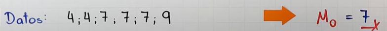
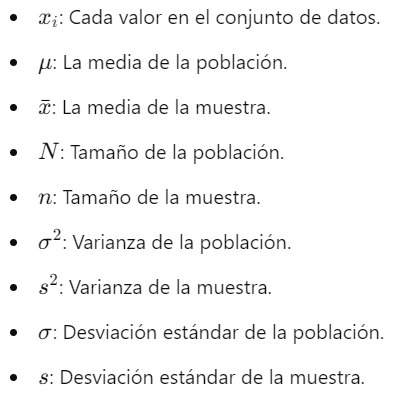
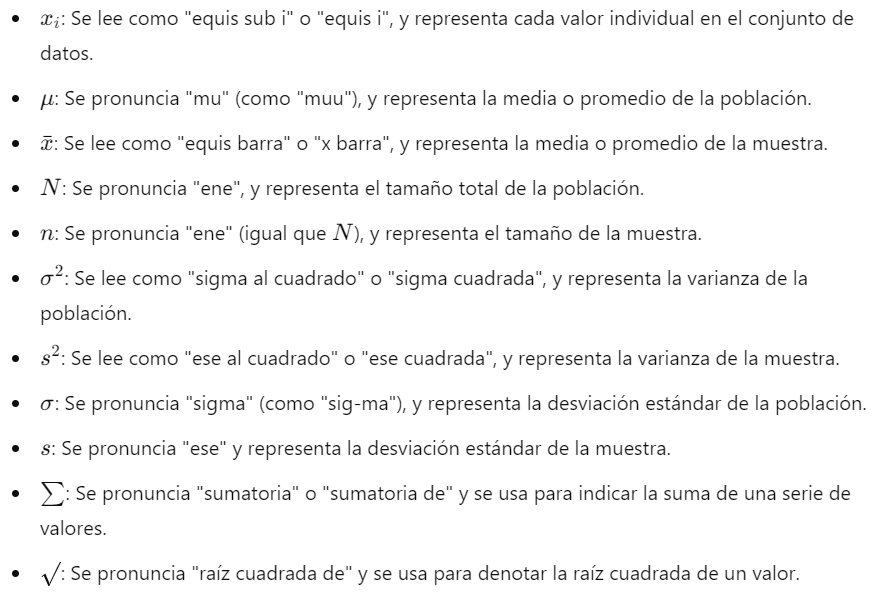
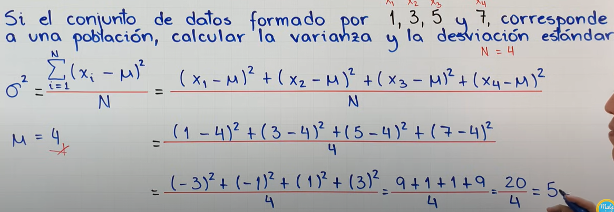
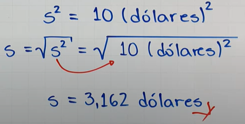
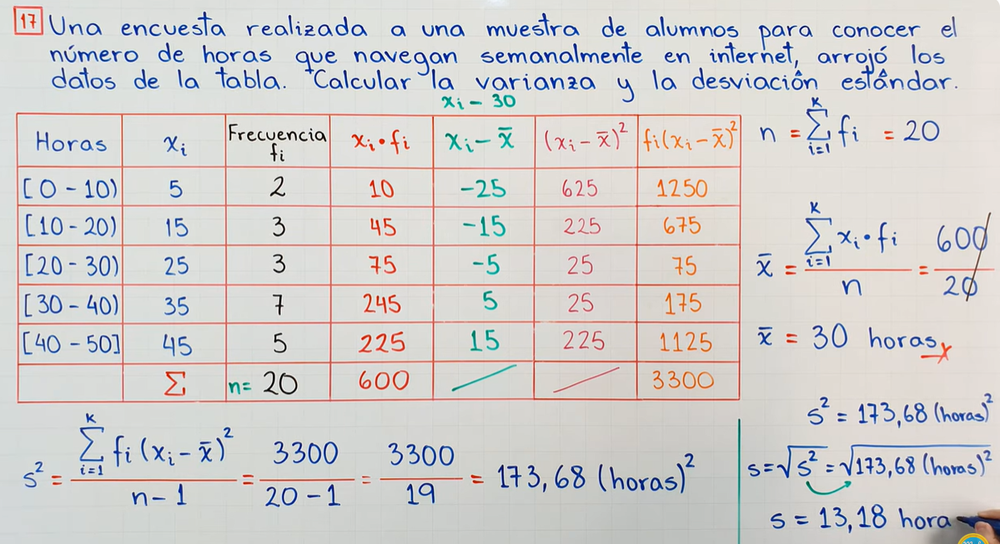
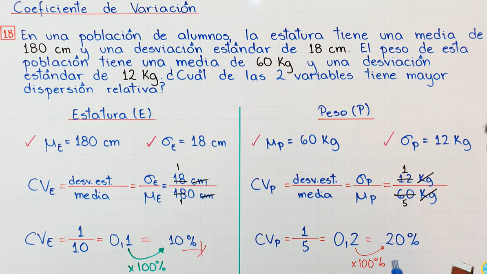
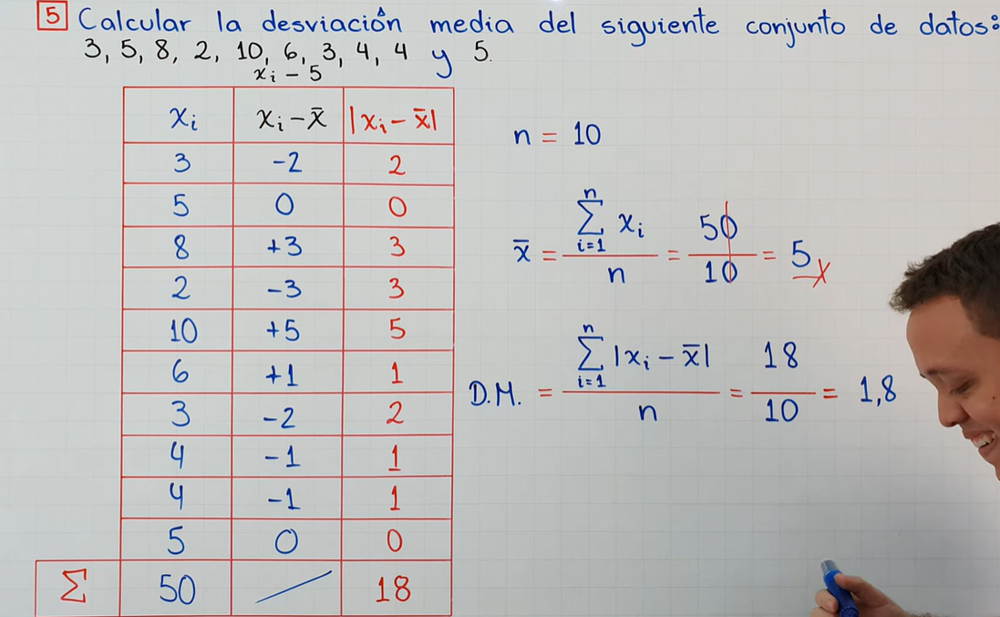
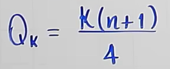
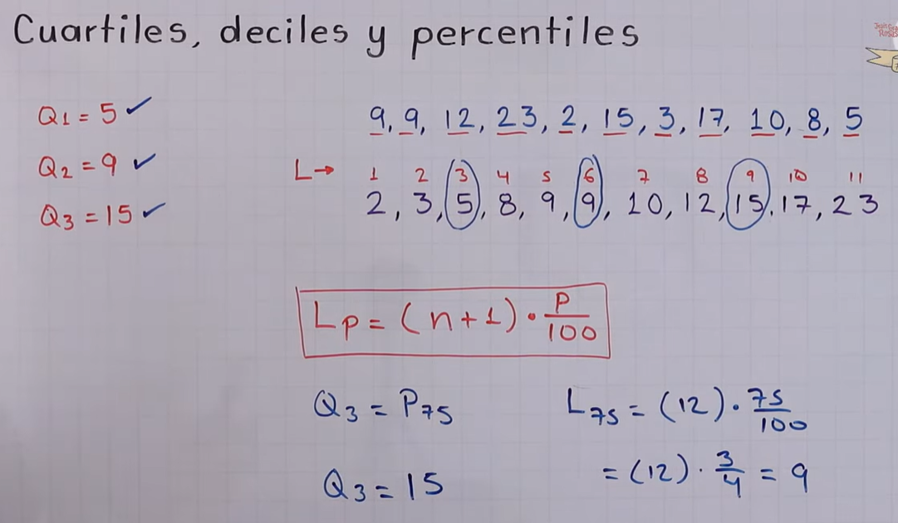

# Estadísticas


## Índice

- [Estadísticas](#estadísticas)
  - [Índice](#índice)
  - [Distribución binomial](#distribución-binomial)
      - [Características de la distribución binomial](#características-de-la-distribución-binomial)
    - [Fórmula de la Distribución Binomial](#fórmula-de-la-distribución-binomial)
      - [Ejemplo con gráfica](#ejemplo-con-gráfica)
  - [Estadística descriptiva](#estadística-descriptiva)
    - [1. Medidas de Tendencia Central](#1-medidas-de-tendencia-central)
      - [Algunos ejemplos:](#algunos-ejemplos)
    - [2. Medidas de Dispersión (o Variabilidad)](#2-medidas-de-dispersión-o-variabilidad)
      - [Rango](#rango)
      - [Varianza y Desviación Estándar](#varianza-y-desviación-estándar)
      - [Coeficiente de Variacion](#coeficiente-de-variacion)
      - [Desviación Media](#desviación-media)
    - [3. Medidas de Posición](#3-medidas-de-posición)
    - [4. Distribución de Frecuencia](#4-distribución-de-frecuencia)
    - [5. Representación Gráfica de Datos](#5-representación-gráfica-de-datos)
    - [6. Medidas de Forma y Simetría](#6-medidas-de-forma-y-simetría)
  - [Ley de grandes números](#ley-de-grandes-números)
    - [Tipos de la Ley de los Grandes Números](#tipos-de-la-ley-de-los-grandes-números)
    - [Explicación](#explicación)
    - [Fórmulas y Notación](#fórmulas-y-notación)
    - [Ejemplo](#ejemplo)
    - [Importancia](#importancia)
  - [Teorema central del límite](#teorema-central-del-límite)
  - [Regresiones lineales](#regresiones-lineales)
      


## Distribución binomial

Las Matematicas nos dicen que el orden de los factores no alteran el producto.<br>

쯈ue es la distribución binomia?<br>
<p>
Es un modelo de probabilidad que describe el número de éxitos en una serie de ensayos independientes de tipo "éxito o fracaso", donde cada ensayo tiene la misma probabilidad de éxito. Es útil para situaciones donde hay solo dos posibles resultados, como "sí" o "no", "verdadero" o "falso", "aprobado" o "reprobado".
</p>

#### Características de la distribución binomial

Para que una situación se modele con una distribución binomial, debe cumplir con los siguientes criterios:<br>

1. Número fijo de ensayos 𝑛: La situación involucra un número específico de intentos o ensayos.
2. Resultados binarios: Cada ensayo tiene solo dos resultados posibles (éxito o fracaso).
3. Probabilidad constante de éxito 𝑝: La probabilidad de éxito es la misma para cada ensayo.
4. Independencia: Los resultados de cada ensayo no afectan a los demás.

### Fórmula de la Distribución Binomial

La fórmula para calcular la probabilidad de obtener exactamente \( k \) éxitos en \( n \) ensayos es:

$$
P(X = k) = \binom{n}{k} p^k (1 - p)^{n - k}
$$

Donde:
- \( P(X = k) \) es la probabilidad de obtener \( k \) éxitos.
- \( n \) es el número total de ensayos.
- \( k \) es el número de éxitos deseados.
- \( p \) es la probabilidad de éxito en cada ensayo.
- \( 1 - p \) es la probabilidad de fracaso.

El *coeficiente binomial* \( \binom{n}{k} \), también conocido como "combinaciones de \( n \) en \( k \)", se calcula como:

$$
\binom{n}{k} = \frac{n!}{k!(n - k)!}
$$
<br>


<br>

<br>
> Tenemos valores enteros y mayores o iguales que 0. La Distribución Binomial es una distribución de probabilidad D i s c r e t a, no continua.
<br>

> Estudiar Distribución de Poison y no confundir.


<br>

> No olvidar la variable aleatoria binomial que es la X mayúscula.

[Clase explicativa a YouTube](https://www.youtube.com/watch?v=HJgJGYDXojk&list=PL3KGq8pH1bFRKK6-4DHifbjLtnif-O7eW&index=2)

> N Factorial, representado como **n!**, es el producto de todos los números enteros positivos que hay entre el número n y el 1, ej. 4! = 4 * 3 * 2 * 1 = 24   
> NOTA: 0! es igual a 1

**Solución "a"**


<br>

**Solución "b"**


[Grafica y uso de calculadora, aquí.](https://youtu.be/Beaut1peTxY?si=T_erAPHPKlsvzvkZ&t=1012) :point_left:
<br>
#### Ejemplo con gráfica


**Representación Gráfica** 


## Estadística descriptiva

<p>Las estadísticas descriptivas abarcan una variedad de técnicas y medidas que se utilizan para resumir y describir los aspectos importantes de un conjunto de datos. Los temas principales de las estadísticas descriptivas incluyen:</p>

### 1. Medidas de Tendencia Central
   Estas medidas describen el punto central o típico de un conjunto de datos que tienen como objetivo encontrar la parte central de un conjunto de datos.
   - **Media**: El promedio de todos los valores.
   - **Mediana**: El valor central en un conjunto de datos ordenado. 
   - **Moda**: El valor que más se repite en el conjunto de datos.

| Medida    | Fórmula | Descripción|
|-----------|---------|------------|
| **Media** |  | Es el valor que se obtiene al sumar todos los datos y dividir el resultado entre la cantidad de datos.|
| **Mediana**|| Es el valor que ocupa la posición central cuando todos los datos están ordenados.|
| **Moda** | | Es el valor que más se repite. Es el valor con mayor frecuencia absoluta. |

#### Algunos ejemplos:
| Medida    | Ejercicio |
|-----------|---------|
| **Media**  | |
| **Mediana** | |
| **Moda**    |         |

> * Cuando en la **Mediana** la cantidad de valores es un número par, tenemos que tomar la **Media** aritmética, la suma de ambos dividido entre 2. <br>
> * Cuando no hay un valor que **más** se repite, entonces no hay **Moda**.

---

### 2. Medidas de Dispersión (o Variabilidad)
   Las medidas de dispersión indican que tan dispersos o separados se encuentran los datos alrededor de la tendencia central. Son medidas estadísticas que muestran la variabilidad en la distribución de los datos.

   #### Rango

| Media                          | Fórmula            |Descripción   |
|------------------------------- |--------------------|------------- |
| **Rango, Amplitud o Recorrido**|  Rango = valor máximo - valor mínimo| Es la diferencia entre el valor máximo y el mínimo de un conjunto de datos.|

Ejercicio Practico: <br>


> **Población:** Es el conjunto de todos los elementos cuya caracteristicas se van a estudiar. <br>
> **Muestra:** Es un subconjunto de la población.<br>


#### Varianza y Desviación Estándar

> 쯈ue es la varianza y la desviación estándar? La varianza y la desviación estándar son medidas de dispersión que indican qué tan alejados están los valores de los datos respecto a la media (promedio) de un conjunto de datos.

* La varianza mide la media de las desviaciones al cuadrado respecto a la media. Cuanto mayor sea la varianza, más dispersos estarán los datos.
* La desviación estándar es la raíz cuadrada de la varianza y proporciona una medida de dispersión en las mismas unidades que los datos originales. <br>


<br>
|| **Varianza**  | **Desviación Estándar**| **Media** |
|---- |---------------|------------------------|-----------|
| **Población**|Letra y griega sigma elevada al cuadrado y es igual a la sumatoria desde i=1 hasta n (del valor de cada uno de los elementos de la población menos la media poblacional) elevado al cuadrado divido entre el numero de elementos de la población.|Letra y griega sigma, la desviación estándar es la raíz cuadrada positiva de la varianza.|Letra M es igual a la sumatoria desde i=1 hasta n del valor de cada uno de los elementos de la población entre el número de elementos.|
| **Muestra** | Letra "s" elevado al cuadrado y es igual a la sumatoria desde i=1 hasta n del valor de cada una de las observaciones de la muestra menos la media muestral elevada al cuadrado y dividido entre el número de observaciones de la muestra menos 1.| Letra "s" es la desviación estándar de la muestra. La desviación estándar es la raíz cuadrada positiva de la varianza.| La X raya ariba es la media de la muestra, suma los valores y la divide entre la cantidad de valores.| 

<br>

**Explicación de los símbolos:**<br>

|      **Representación**               |  **Sonido**               |
|---------------------------------- |---------------------------|
| |  |


**Ejercicios Practicos**

Varianza poblacional:<br>


> Y para sacar la desviación estándar poblacional del ejercicio anterior, solo sacamos la raíz cuadrada.<br>
> 


Varianza muestral: <br>


> Y para sacar la desviación estándar muestral del ejercicio anterior, solo sacamos la raíz cuadrada.<br>




**Ejemplos en tablas de frecuencia por intervalos:**
| Varianza y Desviación Poblacional    | Varianza y Desviación Muestral|
|--------------------------------------|-------------------------------|
|  | |

#### Coeficiente de Variacion

* Es una medida de dispersión relativa (no tiene unidades de medida: ~~kg~~, ~~cm~~).
* Se define como el  cociente entre la desviación estándar y la media.
* Se usa para comparar la variabilidad o dispersión en conjuntos de datos con diferentes unidades de medida.
* También es útil para comparar la variabilidad o dispersión en conjuntos de datos con diferentes medidas.
  

|        **Forma Relativa**            |       **Forma Porcentual**    |
|--------------------------------------|-------------------------------|
|  | |

**Ejemplos de Coeficiente de variación**

|        **Ejemplo 1**            |       **Ejemplo 2**    |
|--------------------------------------|-------------------------------|
|  | |


#### Desviación Media

<p>Es la media aritmética de los valores absolutos de lo que se desvía cada valor respecto a la media. La desviación media siempre va a quedar expresada en las misma unidades que los valores originales.</p>

> Hay que hacer enfasis en la palabra **absoluto**, ya que los numeros negativos pasarán a positivos solo por el simple hecho de pasar a desviación media.

 Esta formula esta expresada en muestra y no en población, para cambiarla a población la n tiene que pasar a mayúscula "N" y la media de los datos pasa a ser la letra "M" mu.<br>

**Esta es la formula de la desviación media para la población**


**Y como se ha explicado antes, no existen numeros negativos, así que la siguiente gráfica se explicará en números positivos**


|        **Ejemplo 1**             |       **Ejemplo 2**    |
|----------------------------------|-------------------------------|
|  | |

> Los ejercicios entre corchetes significa que los datos se encuentran ante un extremo cerrado.


**Ejemplo completo de medidas de dispersión para datos no agrupados.**


[Medidas de dispersión para datos agrupados, aquí.](https://youtu.be/VjCeoPLmbhI?si=ME5QYHxLzO3FVyN-) :point_left:

---

### 3. Medidas de Posición
   Estas medidas muestran cómo se sitúan ciertos valores dentro del conjunto de datos y permiten conocer la **ubicación** relativa de un valor en comparación con otros valores del conjunto. Incluyen:

   - **Cuartiles**: representan los valores 25%, 50% y 75%. **Q2 coincide con la mediana.**
   - **Percentiles**: Son 100 valores que se representan en 99 posiciones donde el Q1 va a estar en la misma posición que el percentil 25, el Q2 en el percentil 50 y el Q3 en el percentil 75. El decil 8 es igual al percentil 80.
   - **Deciles**: determinan los valores 10%, 20%, 30%,...90% de los datos, D5 coincide con Me.
   - **Rango Intercuartílico**: La diferencia entre el percentil 75 y el percentil 25.

                                                                                                              
| Media           | Fórmula Impar   | Formula Par       |Descripción   |
|-----------------|-----------------|-------------------|------------- |
| **Cuartiles**   | |  |Son 3 valores de la variable que dividen a un conjunto de datos ordenados en **4** partes iguales.|
| **Percentiles** | |  |Los percentiles son 99 valores que dividen un conjunto de datos ordenados en **100** partes iguales. |
| **Deciles**     |                    |   |Son 9 valores de la variable que **dividen** el conjunto de datos ordenados en **10** partes iguales. K es la posición que quiero encontra.           |
                         


**Explicación de distribución**


**Ejemplos:**

|    **Q1**   |      **Q2**       | **Q3** |
|-------------|-------------------|--------|
| ||


---

### 4. Distribución de Frecuencia
   Una forma de representar datos agrupados en intervalos, mostrando cuántas veces ocurre cada valor o rango de valores:
   - **Tablas de frecuencia**: Agrupan los datos en categorías o intervalos.
   - **Frecuencia relativa**: La proporción de veces que un valor ocurre en relación al total de valores.
   - **Frecuencia acumulada**: La suma de las frecuencias hasta un cierto punto en el conjunto de datos.
                                                                         

| Media                   | Fórmula            |Descripción   |
|-------------------------|--------------------|------------- |
| **Tablas de frecuencia**|                    |              |
| **Frecuencia relativa** |                    |              |
| **Frecuencia acumulada**|                    |              |

### 5. Representación Gráfica de Datos
   Las gráficas son herramientas visuales para analizar la distribución y las características de los datos. Ejemplos de gráficos usados en estadísticas descriptivas:                                                        

| Medida                        |Representación  |Descripción|
|-------------------------------|-------------|--------------|
| **Histogramas**       | |Representan la frecuencia de los datos en intervalos.|
| **Gráficos de barras**        | |Comparan diferentes categorías o valores.|
| **Diagramas de caja**         | |Muestran la dispersión y detectan posibles valores atípicos.|
| **Gráficos circulares**       | |Representan porcentajes de un total.|
| **Gráficos de dispersión**    | |Usados para ver relaciones entre dos variables.|


### 6. Medidas de Forma y Simetría
   Estas medidas describen la forma de la distribución de los datos:

| Medida                   | Representación | Descripción |
|--------------------------|--------------|---------------|
| **Asimetría (skewness)** ||Indica si la distribución tiene sesgo hacia la derecha o hacia la izquierda.|           
| **Curtosis**             ||  Mide el grado de concentración de los datos en el centro de la distribución; puede indicar si la distribución es más o menos "puntiaguda" en comparación con una distribución normal.|


## Ley de grandes números

<p>Es un teorema fundamental en la probabilidad y la estadística que describe el comportamiento de una muestra a medida que aumenta su tamaño. Explica que, bajo ciertas condiciones, la media de los resultados obtenidos de un gran número de experimentos repetidos se aproximará a la media esperada o teórica.</p>

### Tipos de la Ley de los Grandes Números
Existen dos tipos principales de la Ley de los Grandes Números:
1. **Ley de los Grandes Números Débil**: Establece que, para un número suficientemente grande de observaciones, la media muestral convergerá en probabilidad hacia la media poblacional.
2. **Ley de los Grandes Números Fuerte**: Declara que, al aumentar indefinidamente el número de observaciones, la media muestral converge casi con certeza (probabilidad 1) a la media poblacional.

### Explicación
Si \( X_1, X_2, \ldots, X_n \) son variables aleatorias independientes e idénticamente distribuidas con media esperada \( \mu \), entonces la media muestral:
\[
\bar{X}_n = \frac{1}{n} \sum_{i=1}^n X_i
\]
se aproximará a \( \mu \) a medida que \( n \) tiende a infinito. Esto es:
\[
\lim_{{n \to \infty}} \bar{X}_n = \mu
\]

### Fórmulas y Notación
| Notación                | Descripción                                                                                |
|-------------------------|--------------------------------------------------------------------------------------------|
| \( X_1, X_2, \ldots, X_n \) | Variables aleatorias independientes con distribución idéntica y media esperada \( \mu \). |
| \( \bar{X}_n \)              | Media muestral calculada como \( \bar{X}_n = \frac{1}{n} \sum_{i=1}^n X_i \).          |
| \( \lim_{{n \to \infty}} \bar{X}_n = \mu \) | Convergencia de la media muestral hacia la media poblacional \( \mu \) a medida que \( n \) crece. |

### Ejemplo
Consideremos un experimento en el que lanzamos una moneda equilibrada. La probabilidad de obtener **cara** o **cruz** es 0.5. Según la Ley de los Grandes Números:
- Si lanzamos la moneda solo 10 veces, la proporción de caras podría no ser exactamente 0.5 debido a la pequeña muestra.
- Sin embargo, si lanzamos la moneda 1,000 o 10,000 veces, la proporción de caras tenderá a acercarse cada vez más a 0.5.

### Importancia
La Ley de los Grandes Números es esencial para la estadística inferencial, ya que garantiza que las muestras grandes proporcionan estimaciones más precisas de los parámetros poblacionales.

---

Este teorema nos permite confiar en los resultados de experimentos de gran tamaño, y en cómo las medias muestrales tienden a representar mejor la media poblacional conforme aumenta el tamaño de la muestra.


## Teorema central del límite
Aquí va el contenido de la sección del teorema central del límite.
> esta es una nota

## Regresiones lineales
Aquí va el contenido de la sección de regresiones lineales.
> esta es una nota


`
Codigo
    escrrito
    para programadores
    que
necesita codigo
`

```python
print("hello world")
```

| Table | Are   | Cool  |
|-------|-------|-------|
| Mesa  | es    | chida |
| quiero| comer | carne |
|       |       |       |

  


[def]: assets/varianza.png